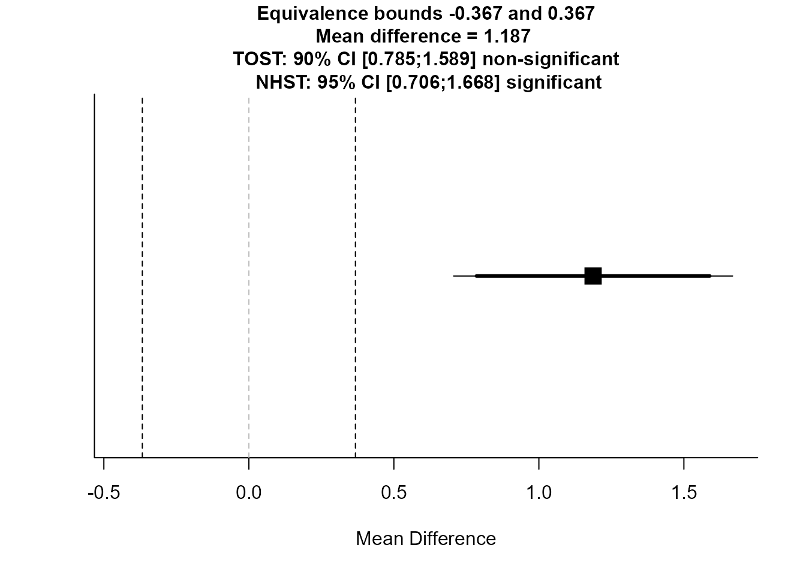
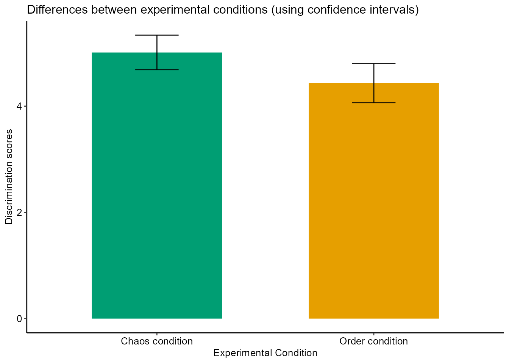
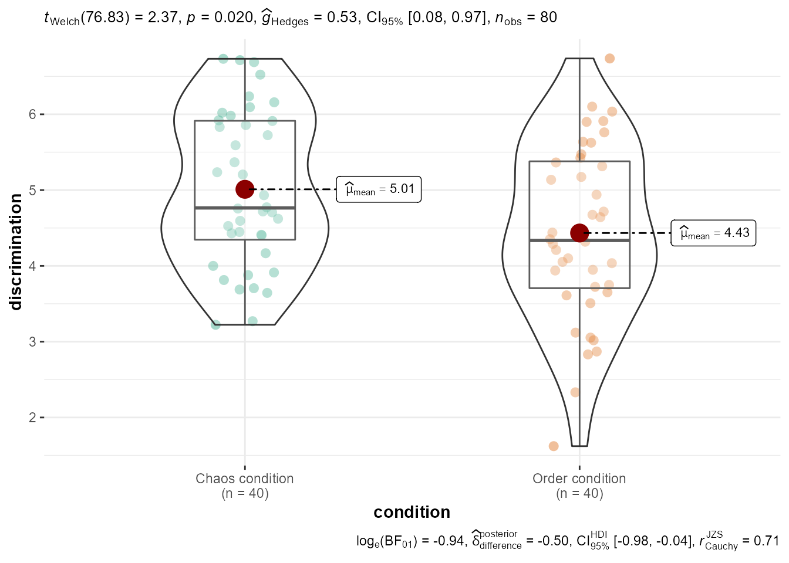
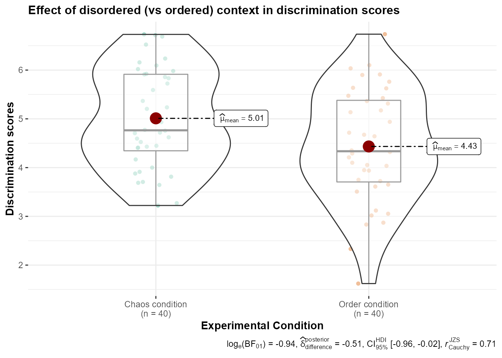
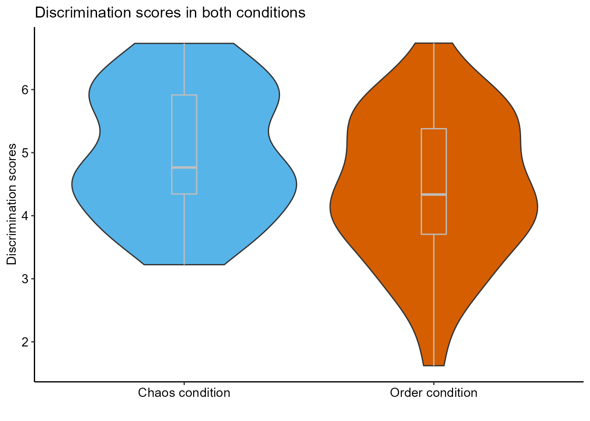
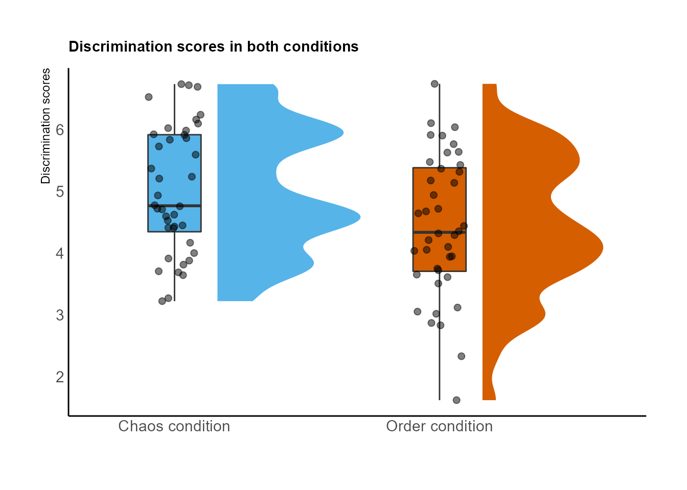
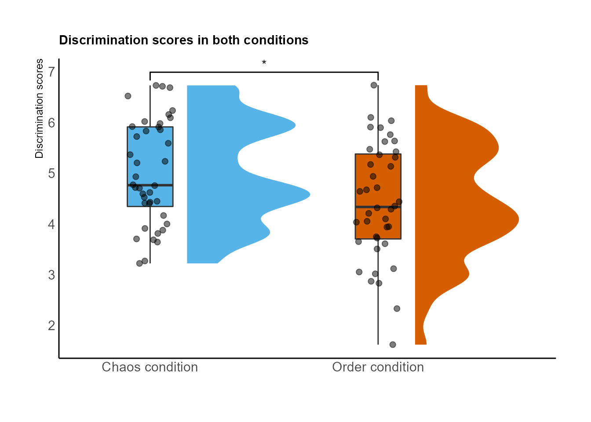
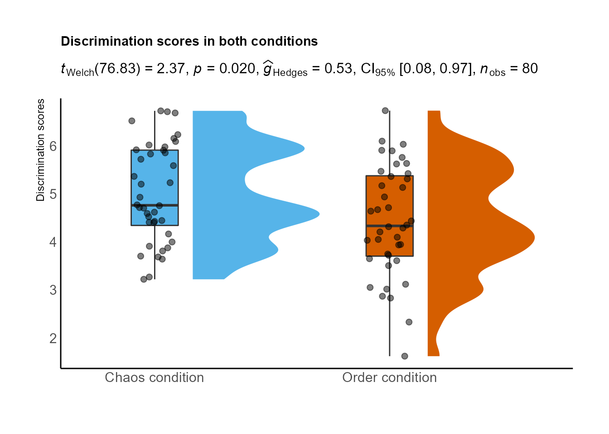
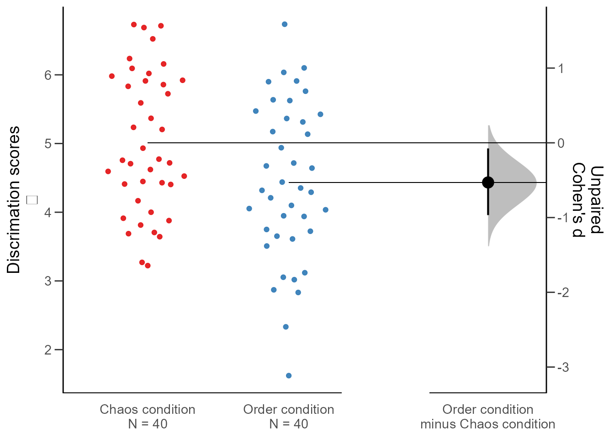

## 0. Simulando los datos para nuestro ejemplo

Primero simulamos los datos, basándonos en los parámetros del primer estudio de [Stapel y Lindenberg (2011)](https://science.sciencemag.org/content/332/6026/251.abstract?casa_token=VFzHSJ78wLwAAAAA:3oyCp3jtxNJJf7DBXch4CmNf0K6Q0Ttv2XXuQUZvgcnH6MQzNru95flX_vmsYO-j5X0WhhVwiezjcr_V) sobre cómo influye un contexto ordenado vs desordenado en la discriminación (también simulados, je). Esto es solo para tener unos datos con los que trabajar; en cada ejemplo se explica dónde tendríamos que situar nuestras variables.

```{r}
set.seed(42) # Para reproducibilidad

discrimination <- rnorm(n = 40, mean = 5.12, sd = 1.01) # Datos para el grupo 1
data0 <- as.data.frame(discrimination)
data0$condition <- 1

discrimination <- rnorm(n = 40, mean = 4.28, sd = 1.03) # Datos para el grupo 2
data1 <- as.data.frame(discrimination)
data1$condition <- 2

data <- rbind(data0, data1)

data$condition <- factor(data$condition,
  levels = c(1, 2),
  labels = c("Chaos condition", "Order condition"))
```

## 1. Paquetes

```{r}
#| message: false
#| results: hide

library(effectsize)  # Para calcular tamaños del efecto
library(ggstatsplot) # Para representaciones gráficas
library(car)         # Para comprobar homogeneidad de varianzas con leveneTest()
library(dplyr)       # Para transformaciones de datos
library(ggplot2)
```

Utilizaremos otros paquetes en otros apartados, que irán apareciendo. Hay que tener en cuenta que algunas funciones "solapan" entre paquetes.

Si no tenemos el paquete instalado, antes del comando `library(paquete)` lo descargamos con `install.packages("paquete")`.

Dos cosas básicas a tener en cuenta:

1. En nuestro ejemplo, la variable dependiente se llama `discrimination` y la independiente `condition`. Para usar el código con tus datos tendrás que sustituir estos nombres por los de tus variables.
2. Cuando usamos el símbolo `$` después del nombre de la base de datos, pedimos al programa que busque dentro de esa base de datos la variable que indicamos a continuación.

## 2. Homogeneidad de las varianzas y normalidad

Para la normalidad, utilizamos el test de Shapiro:

```{r}
by(data$discrimination, data$condition, shapiro.test)
```

Para comprobar la homogeneidad de las varianzas, tenemos varias opciones.

**F-test:**

```{r}
var.test(data$discrimination ~ data$condition)
```

**Test de Levene** (por defecto usa la mediana, más robusto; se puede cambiar a `center = "mean"`):

```{r}
leveneTest(y = data$discrimination, group = data$condition, center = "median")
```

**Test de Bartlett:**

```{r}
bartlett.test(data$discrimination ~ data$condition)
```

También podemos realizar el test de Brown-Forsyth con la función `hov()` del paquete `HH` o el Fligner-Killeen test con `fligner.test()`.

Si el resultado del test elegido es p < .05, no podemos asumir que las varianzas son iguales. Si usamos `t.test()`, el propio programa elige entre una prueba u otra en función de la igualdad de varianzas, pero podemos forzarlo con `var.equal = TRUE` o `var.equal = FALSE`.

## 3. Diferencias de medias

```{r}
#| eval: false
?t.test # Para ver todos los argumentos disponibles
```

**Dos grupos independientes, asumiendo varianzas iguales:**

```{r}
t.test(discrimination ~ condition, data = data, alternative = "two.sided", var.equal = TRUE)
```

**Sin asumir varianzas iguales (Welch):**

```{r}
t.test(discrimination ~ condition, data = data, alternative = "two.sided", var.equal = FALSE)
```

**Medidas repetidas:** la interfaz de fórmula no admite `paired = TRUE`, así que extraemos los vectores directamente:

```{r}
chaos <- data$discrimination[data$condition == "Chaos condition"]
orden <- data$discrimination[data$condition == "Order condition"]
t.test(chaos, orden, alternative = "two.sided", paired = TRUE)
```

**Test no paramétrico (Wilcoxon)**, si los datos no siguen una distribución normal:

```{r}
wilcox.test(data$discrimination ~ data$condition, alternative = "two.sided")
```

## 4. La lógica subyacente

Este paso puede saltarse —hay que descargar varios paquetes y hay bastante código—, pero sirve para ilustrar la lógica de una comparación de medias.

El código de este apartado está tomado de una entrada del blog de [Andrew Heiss](https://www.andrewheiss.com/blog/2019/01/29/diff-means-half-dozen-ways/#t-test-assuming-equal-variances). La idea fundamental, explicada también en el blog de [Allen Downey](http://allendowney.blogspot.com/2016/06/there-is-still-only-one-test.html), es que para cualquier test estadístico hacemos lo siguiente:

1. Calcular un estadístico en nuestra muestra.
2. Simular una población donde ese estadístico es nulo.
3. Comparar nuestro estadístico con esa población nula.
4. Calcular la probabilidad de que nuestro estadístico exista en la población nula.
5. Decidir si es significativo (usando normalmente el estándar de .05).

```{r}
#| message: false
#| warning: false
library(infer)
library(scales)
```

Calculamos la diferencia de medias en nuestra muestra:

```{r}
difmed <- data %>%
  specify(discrimination ~ condition) %>%
  calculate("diff in means", order = c("Chaos condition", "Order condition"))
difmed
```

Calculamos el intervalo de confianza usando una distribución *bootstrapped*:

```{r}
#| fig-width: 10
#| fig-height: 5
medboot <- data %>%
  specify(discrimination ~ condition) %>%
  generate(reps = 1000, type = "bootstrap") %>%
  calculate("diff in means", order = c("Chaos condition", "Order condition"))

boostrapped_confint <- medboot %>% get_confidence_interval()

medboot %>%
  visualize() +
  shade_confidence_interval(boostrapped_confint,
    color = "#8bc5ed", fill = "#85d9d2") +
  geom_vline(xintercept = difmed$stat, linewidth = 1, color = "#77002c") +
  labs(
    title = "Distribución 'bootstrapped' de la diferencia de medias",
    x = "Chaos condition - Order condition", y = "Count",
    subtitle = "La línea roja muestra la diferencia observada; la zona sombreada el IC al 95%") +
  theme_classic()
```


Simulamos un mundo donde el estadístico es nulo:

```{r}
#| fig-width: 10
#| fig-height: 5
cond_diffs_null <- data %>%
  specify(discrimination ~ condition) %>%
  hypothesize(null = "independence") %>%
  generate(reps = 5000, type = "permute") %>%
  calculate("diff in means", order = c("Chaos condition", "Order condition"))

cond_diffs_null %>%
  visualize() +
  geom_vline(xintercept = difmed$stat, linewidth = 1, color = "#77002c") +
  scale_y_continuous(labels = comma) +
  labs(
    x = "Diferencia simulada en las medias (Chaos condition - Order condition)",
    y = "Count",
    title = "Distribución nula de las diferencias de medias basada en la simulación",
    subtitle = "La línea roja muestra la diferencia observada") +
  theme_classic()
```


Vemos que parece muy poco probable observar este valor en un mundo sin diferencias entre grupos.

```{r}
#| warning: false
cond_diffs_null %>%
  get_p_value(obs_stat = difmed, direction = "both") %>%
  mutate(p_value_clean = pvalue(p_value))
```

## 5. Tamaño del efecto

Si asumimos varianzas iguales, lo usual es la **d de Cohen**. Si no podemos asumirlo, se recomienda la **g de Hedges** [(Delacre et al., 2021)](https://psyarxiv.com/tu6mp/).

```{r}
cohens_d(discrimination ~ condition, data = data, pooled_sd = TRUE)

hedges_g(discrimination ~ condition, data = data, pooled_sd = FALSE)
```

### 5.1. Interpretar y transformar el tamaño del efecto

Usar los puntos de referencia de Cohen puede ser problemático, ya que no tienen en cuenta el marco de referencia específico. Una alternativa es usar las guías basadas en los tamaños del efecto habituales en psicología social [(Lovakov & Agadullina, 2021)](https://onlinelibrary.wiley.com/doi/full/10.1002/ejsp.2752?casa_token=PmPfBBvNPCkAAAAA%3AT1_sP2N3IYi9r14sUyov3O0_6agZCH1Ca_ysoURGjg9x_zraGhcs0gYCrkEPzdSUBfC-Rkq7A_xD0wtKHg), donde los percentiles 25, 50 y 75 corresponden a d = 0.15, 0.36 y 0.65.

```{r}
interpret_d(1.10, rules = "cohen1988")
interpret_d(1.10, rules = "lovakov2021")
```

También podemos transformar la d de Cohen a un coeficiente de correlación:

```{r}
d_to_r(1.10)
```

## 6. Test de equivalencias

Para entender los test de equivalencias, se puede consultar [Lakens (2017)](https://journals.sagepub.com/doi/full/10.1177/1948550617697177) y [Lakens, Scheel e Isager (2018)](https://journals.sagepub.com/doi/full/10.1177/2515245918770963). En concreto nos interesan los TOST (*two one-sided tests*).

La idea: establecer a priori un límite superior e inferior de equivalencia basándonos en el mínimo efecto de interés (SESOI). Si nuestro efecto cae entre esos intervalos, podemos decir que es lo suficientemente cercano a cero para ser equivalente en la práctica.

En nuestro caso, siguiendo a Stapel y Lindenberg (2011), determinamos el SESOI como el tamaño del efecto detectable con un poder del 33% [(Simonsohn, 2015)](https://journals.sagepub.com/doi/full/10.1177/0956797614567341?casa_token=h5QriJpfjv8AAAAA%3Awbyl5p2W703wEgvkTuRyqPwewXG3iGGEYyc4kbm-0DiEFbJasPhMTguTnZnceDpU3XTH47R5hbdgSBs), que sería d = 0.34.

```{r}
#| warning: false
library(TOSTER)

# tsum_TOST() es la función actualizada (TOSTtwo() está deprecada en TOSTER >= 0.4)
tsum_TOST(
  m1 = 5.218811, m2 = 4.031867,
  sd1 = 1.088976, sd2 = 1.072184,
  n1 = 40, n2 = 40,
  low_eqbound = -0.34, high_eqbound = 0.34,
  eqbound_type = "SMD",
  alpha = 0.05,
  var.equal = TRUE)
```



El output nos indica que el efecto **no es estadísticamente equivalente a cero**.

## 7. Representaciones gráficas

### 7.1. Barplot

```{r}
#| warning: false
library(ggpubr)

infograph <- data %>%
  group_by(condition) %>%
  summarise(n = n(), mean = mean(discrimination), sd = sd(discrimination)) %>%
  mutate(se = sd / sqrt(n)) %>%
  mutate(ic = se * qt((1 - 0.05) / 2 + .5, n - 1))

pal <- c("#009E73", "#E69F00") # Paleta colorblind-friendly

barplt <- ggplot(infograph) +
  geom_col(aes(x = condition, y = mean, fill = condition), alpha = 1, width = 0.6) +
  scale_fill_manual(values = pal) +
  geom_errorbar(aes(x = condition, ymin = mean - ic, ymax = mean + ic),
    width = 0.2, colour = "black", alpha = 0.9, linewidth = 0.5) +
  ggtitle("Differences between experimental conditions (using confidence intervals)") +
  xlab("Experimental Condition") +
  ylab("Discrimination scores")

barplt + theme_pubr(base_size = 10, border = FALSE, margin = TRUE, legend = "none")
```



### 7.2. Gráficos de violín

La forma más rápida con `ggbetweenstats` del paquete `ggstatsplot`:

```{r}
#| warning: false
#| message: false
ggbetweenstats(data = data, x = condition, y = discrimination)
```



Con más opciones de personalización:

```{r}
#| warning: false
#| message: false
ggbetweenstats(
  data, condition, discrimination,
  plot.type = "boxviolin",
  type = "parametric",
  title = "Effect of disordered (vs ordered) context in discrimination scores",
  xlab = "Experimental Condition",
  ylab = "Discrimination scores",
  centrality.point.args = list(size = 5, color = "darkred"),
  centrality.label.args = list(size = 3, nudge_x = 0.4, segment.linetype = 4,
    min.segment.length = 0),
  point.args = list(position = ggplot2::position_jitterdodge(dodge.width = 0.4),
    alpha = 0.4, size = 2, stroke = 0),
  violin.args = list(width = 0.7, alpha = 0.5),
  package = "RColorBrewer", palette = "Dark2")
```



Otra forma con `ggplot2`:

```{r}
#| warning: false
#| message: false
library(viridis)

ggplot(data, aes(x = condition, y = discrimination, fill = condition)) +
  geom_violin() +
  geom_boxplot(width = 0.1, color = "grey", alpha = 0.5) +
  scale_fill_manual(values = c("#56B4E9", "#D55E00")) +
  ggtitle("Discrimination scores in both conditions") +
  xlab("") +
  ylab("Discrimination scores") +
  theme_pubr(base_size = 11, border = FALSE, margin = TRUE, legend = "none")
```



*Raincloud plot* (violín + boxplot + puntos):

```{r}
#| warning: false
#| message: false
library(ggdist)

ggplot(data, aes(x = condition, y = discrimination, fill = condition)) +
  stat_halfeye(adjust = .5, width = .6, .width = 0,
    justification = -.3, point_colour = NA) +
  geom_boxplot(width = .20, outlier.shape = NA) +
  geom_point(size = 2, alpha = .5,
    position = position_jitter(seed = 1, width = .1)) +
  coord_cartesian(xlim = c(1.2, NA), clip = "off") +
  scale_fill_manual(values = c("#56B4E9", "#D55E00")) +
  ggtitle("Discrimination scores in both conditions") +
  xlab("") +
  ylab("Discrimination scores") +
  theme_pubr(base_size = 11, border = FALSE, margin = TRUE, legend = "none")
```



Añadiendo la significación estadística con `ggsignif`:

```{r}
#| warning: false
#| message: false
library(ggsignif)

ggplot(data, aes(x = condition, y = discrimination, fill = condition)) +
  stat_halfeye(adjust = .5, width = .6, .width = 0,
    justification = -.3, point_colour = NA) +
  geom_boxplot(width = .20, outlier.shape = NA) +
  geom_signif(comparisons = list(c("Chaos condition", "Order condition")),
    map_signif_level = TRUE) +
  geom_point(size = 2, alpha = .5,
    position = position_jitter(seed = 1, width = .1)) +
  coord_cartesian(xlim = c(1.2, NA), clip = "off") +
  scale_fill_manual(values = c("#56B4E9", "#D55E00")) +
  ggtitle("Discrimination scores in both conditions") +
  xlab("") +
  ylab("Discrimination scores") +
  theme_pubr(base_size = 11, border = FALSE, margin = TRUE, legend = "none")
```



Incluyendo el resultado estadístico directamente con `statsExpressions`:

```{r}
#| warning: false
#| message: false
library(statsExpressions)

expresion <- two_sample_test(
  data = data,
  x = condition,
  y = discrimination,
  alternative = "two.sided")

ggplot(data, aes(x = condition, y = discrimination, fill = condition)) +
  stat_halfeye(adjust = .5, width = .6, .width = 0,
    justification = -.3, point_colour = NA) +
  geom_boxplot(width = .20, outlier.shape = NA) +
  geom_point(size = 2, alpha = .5,
    position = position_jitter(seed = 1, width = .1)) +
  coord_cartesian(xlim = c(1.2, NA), clip = "off") +
  scale_fill_manual(values = c("#56B4E9", "#D55E00")) +
  ggtitle("Discrimination scores in both conditions",
    subtitle = expresion$expression[[1]]) +
  xlab("") +
  ylab("Discrimination scores") +
  theme_pubr(base_size = 11, border = FALSE, margin = TRUE, legend = "none")
```



### 7.3. Estimation plots con `dabestr`

::: {.callout-note}
La API de `dabestr` cambió significativamente en la versión 0.3. El código siguiente es orientativo; consulta la [documentación actualizada](https://cran.r-project.org/package=dabestr) si usas una versión reciente del paquete.
:::

```{r}
#| eval: false
library(dabestr)

two.group <- data %>%
  dabest(condition, discrimination,
    idx = c("Chaos condition", "Order condition"),
    paired = FALSE)

two.group.meandiff <- mean_diff(two.group)
plot(two.group.meandiff, rawplot.ylabel = "Discrimination scores")
```



### 7.4. Guardar los gráficos

La forma más cómoda es `ggsave()` directamente sobre un objeto de `ggplot2`:

```{r}
#| eval: false
# Primero guardamos el gráfico como objeto
Grafico <- ggplot(data, aes(x = condition, y = discrimination, fill = condition)) +
  stat_halfeye(adjust = .5, width = .6, .width = 0,
    justification = -.3, point_colour = NA) +
  geom_boxplot(width = .20, outlier.shape = NA) +
  geom_point(size = 2, alpha = .5,
    position = position_jitter(seed = 1, width = .1)) +
  coord_cartesian(xlim = c(1.2, NA), clip = "off") +
  scale_fill_manual(values = c("#56B4E9", "#D55E00")) +
  ggtitle("Discrimination scores in both conditions") +
  xlab("") + ylab("Discrimination scores") +
  theme_pubr(legend = "none")

# Luego lo exportamos
ggsave("Figure1.png", plot = Grafico, width = 10, height = 7, dpi = 300)
```
