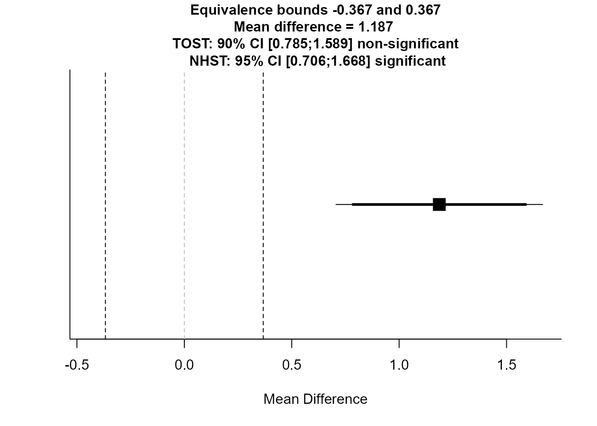
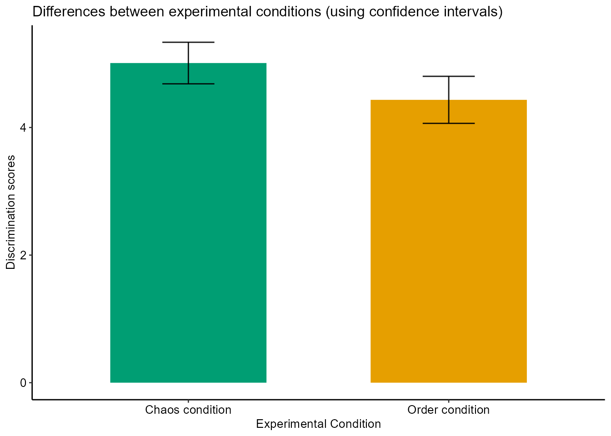
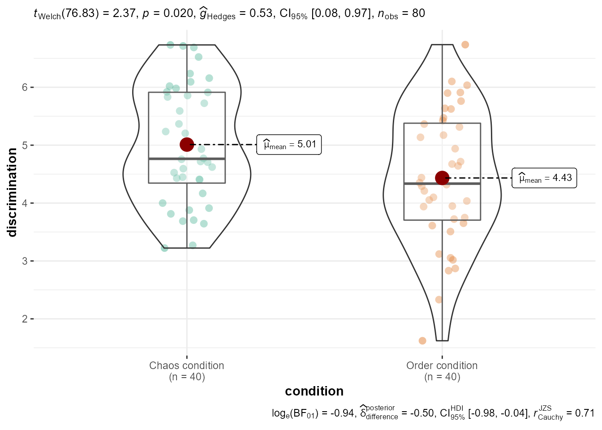
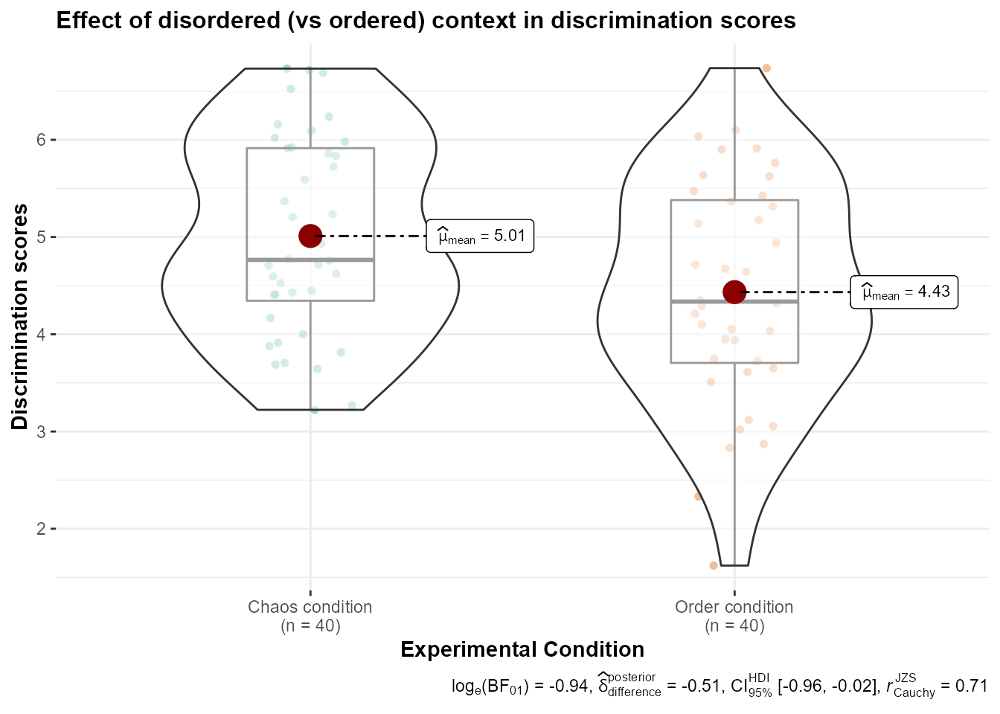
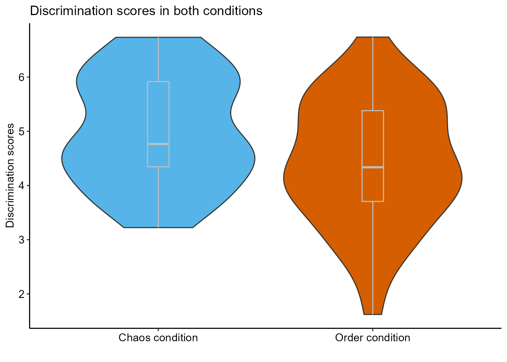
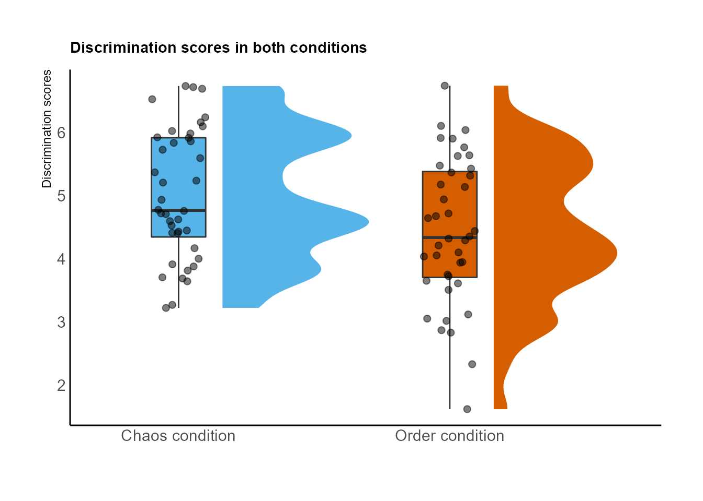
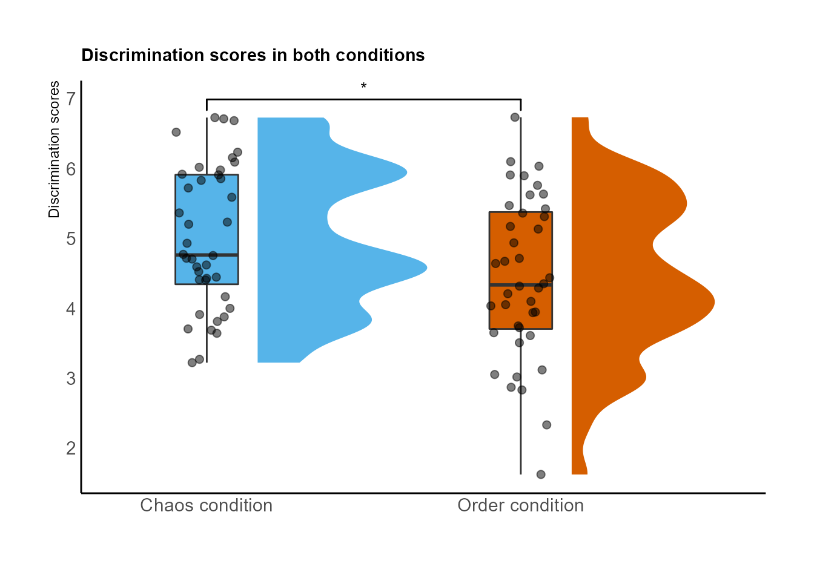
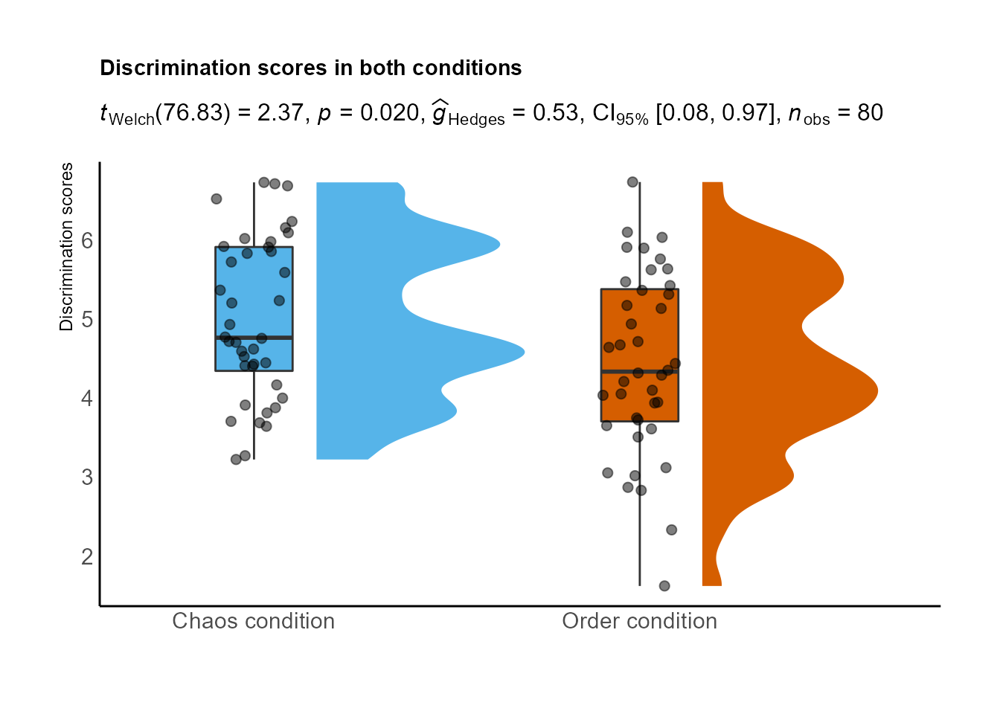
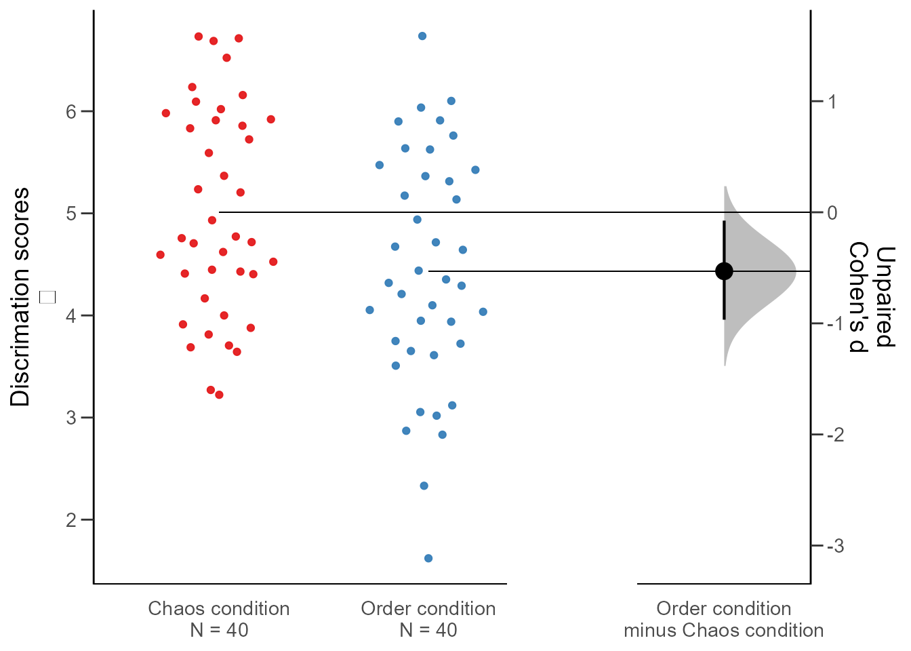

<!-- toc -->

- [0. Simulando los datos para nuestro ejemplo](##0.-Simulando-los-datos-para-nuestro-ejemplo)
- [1. Paquetes](##1.-Paquetes)
- [2. Homogeneidad de las varianzas y normalidad](##2.-Homogeneidad-de-las-varianzas-y-normalidad)
- [3. Diferencias de medias](##3.-Diferencias%-de-medias)
- [4. La lógica subyacente](##4.-La-lógica-subyacente)
- [5. Tamaño del efecto](##5.-Tamaño-del-efecto)
  * [5.1. Interpretar y transformar el tamaño del efecto](###5.1.-Interpretar-y-transformar-el-tamaño-del-efecto)
- [6. Test de equivalencias](##6.-Test-del-equivalencias)
- [7. Representaciones gráficas de diferencias de medias y distribuciones de dos grupos](##7.-Representaciones-gráficas-de-diferencias-de-medias-y-distribuciones-de-dos-grupos)
  * [7.1. Barplot](###7.1.-Barplot)
  * [7.2. Gráficos de violín](###7.2.-Gráficos-de-violín)
  * [7.3. Otros gráficos](###7.3.-Otros-gráficos)
  * [7.4. Guardar los gráficos](###7.4.-Guardar-los-gráficos)


## 0. Simulando los datos para nuestro ejemplo

Primero simulamos los datos, basándonos en los parámetros del primer estudio de  [Stapel y Lindenberg (2011)](https://science.sciencemag.org/content/332/6026/251.abstract?casa_token=VFzHSJ78wLwAAAAA:3oyCp3jtxNJJf7DBXch4CmNf0K6Q0Ttv2XXuQUZvgcnH6MQzNru95flX_vmsYO-j5X0WhhVwiezjcr_V) sobre cómo influye un contexto ordenado vs desordenado en la discriminación (también simulados, je). Esto es solo para tener unos datos con los que trabajar, en cada ejemplo se explica dónde tendríamos que situar nuestras variables. 

```{r}

discrimination <- (rnorm(n = 40, mean = 5.12, sd = 1.01)) #Generamos los datos para la primera media (del grupo 1)

data0 <- as.data.frame(discrimination)

data0$condition <- 1
  
discrimination <- rnorm(n = 40, mean = 4.28, sd = 1.03) #Generamos los datos para la segunda media (del grupo 2)

data1 <- as.data.frame(discrimination)

data1$condition <- 2

data <- rbind(data0, data1)

data$condition <- factor(data$condition,
levels = c(1,2),
labels = c("Chaos condition", "Order condition")) #añadimos etiquetas para las condiciones


```


## 1. Paquetes


```{r paquetes necesarios, message=FALSE, results='hide'}

library(effectsize) #Para calcular tamaños del efecto
library(ggstatsplot) #Para representaciones gráficas 
library(car) #Para comprobar homogeneidad varianzas con leveneTest()
library(dplyr) #Para algunas transformaciones de los datos
library(ggplot2)

```

Utilizaremos otros paquetes en otros apartados, que irán apareciendo, pero de momento cargamos únicamente estos; hay que tener en cuenta que hay funciones que "solapan". 

Si no tenemos el paquete en la librería, antes del comando library(paquete) lo descargamos con install.packages(paquete).

Hay que tener en cuenta un par de cosas básicas: 

  1. En nuestro ejemplo, la variable dependiente se llama discrimination (las puntuaciones en la escala de discriminación) y la independiente se llama condicion (las dos condiciones que tenemos). Por tanto, para utilizar el código con nuestros datos tendremos que sustituir estos nombres por los nombres de nuestras variables en nuestra base de datos. 
  2. Cuando utilizamos el símbolo del dolar "$" después del nombre de nuestra base de datos estamos pidiendo al programa que busque dentro de esa base de datos. Luego ponemos la variable sobre la que queramso trabajar. 

## 2. Homogeneidad de las varianzas y normalidad

Para la normalidad, utilizamos el test de Shapiro: 

```{r}

by(data$discrimination, data$condition, shapiro.test)

```

```{r}
## data$condition: Chaos condition
## 
##  Shapiro-Wilk normality test
## 
## data:  dd[x, ]
## W = 0.98371, p-value = 0.8228
## 
## ---------------------------------- 
## data$condition: Order condition
## 
##  Shapiro-Wilk normality test
## 
## data:  dd[x, ]
## W = 0.97414, p-value = 0.4815
```

Para comprobar la homogeneidad de las varianzas:

F-test:

```{r}

var.test(data$discrimination ~ data$condition) #F-test para comprobar la homogeneidad de las varianzas

```

```{r}

##  F test to compare two variances
## 
## data:  data$discrimination by data$condition
## F = 0.68234, num df = 39, denom df = 39, p-value = 0.2371
## alternative hypothesis: true ratio of variances is not equal to 1
## 95 percent confidence interval:
##  0.360889 1.290113
## sample estimates:
## ratio of variances 
##          0.6823398
```

Test de Levene. Por defecto utiliza la mediana (más robusto), pero podemos elegir la media con sustituyendo en el argumento center = "mean"

```{r}

leveneTest(y = data$discrimination, group = data$condition, center = "median") 

```

```{r}

## Levene's Test for Homogeneity of Variance (center = "median")
##       Df F value Pr(>F)
## group  1  1.0802 0.3019
##       78

```

Test de Barlett:

```{r}

bartlett.test(data$discrimination ~ data$condition)

```

```{r}

##  Bartlett test of homogeneity of variances
## 
## data:  data$discrimination by data$condition
## Bartlett's K-squared = 1.3979, df = 1, p-value = 0.2371

```

También podemos realizar el test de Brown-Forsyth con la función hov() del paquete HH o el Fligner-Killeen test utilizando la misma fórmula y la función fligner.test(). 

Si el resultado del test que elijamos es p < .05 no podemos asumir que las varianzas son iguales. Estas pruebas apuntarían a que nuestros grupos las varianzas no son homogéneas y utilizaríamos pruebas distintas para calcular  si hay diferencias significativas entre las medias. 

Si utilizamos t.test() para las diferencias de medias el propio programa lleva a cabo una prueba (e.g. Two Sample t-test) u otra (e.g. Welch Two Sample t-test) en función de si hay igualdad de las varianzas, pero podemos forzarlo asumir igualdad de varianzas con el argumento var.equal = TRUE o a asumir lo contrario, con el argumento var.equal = FALSE. Por tanto, está bien tener control sobre lo que hacemos y elegir la mejor prueba, teniendo en cuanta nuestras consideraciones teóricas, para estudiar la homogeneidad de la varianza y, en consecuencia, el mejor test de comparación de medias. 

## 3. Diferencias de medias


```{r, eval=FALSE}


?t.test #para ver todos los argumentos que podemos añadir a la función. Por ejemplo, alternative = "two.sided" si queremos que la prueba sea bidireccional o de dos colas; alternative = "greater" unidireccional y esperamos que sea positivo el resultado; alternative = "less", unidireccional y esperamos que sea negativo el resultado etc. 


```

Diferencia dos grupos independientes, asumiendo varianzas iguales: 

```{r}

t.test(discrimination ~ condition, data = data, alternative = "two.sided", var.equal = TRUE)

```

```{r}

##  Two Sample t-test
## 
## data:  discrimination by condition
## t = 2.8596, df = 78, p-value = 0.00544
## alternative hypothesis: true difference in means between group Chaos condition and group Order condition is not equal to 0
## 95 percent confidence interval:
##  0.2013203 1.1240440
## sample estimates:
## mean in group Chaos condition mean in group Order condition 
##                      5.120439                      4.457757

```

Si no podemos asumir varianzas iguales: 

```{r}

t.test(discrimination ~ condition, data = data, alternative = "two.sided", var.equal = FALSE)

```

```{r}

##  Welch Two Sample t-test
## 
## data:  discrimination by condition
## t = 2.8596, df = 75.315, p-value = 0.005485
## alternative hypothesis: true difference in means between group Chaos condition and group Order condition is not equal to 0
## 95 percent confidence interval:
##  0.201061 1.124303
## sample estimates:
## mean in group Chaos condition mean in group Order condition 
##                      5.120439                      4.457757

```

Medidas repetidas

```{r}

t.test(discrimination ~ condition, data = data, alternative = "two.sided", paired = TRUE, var.equal = TRUE)

```
```{r}
##  Paired t-test
## 
## data:  discrimination by condition
## t = 3.1202, df = 39, p-value = 0.003394
## alternative hypothesis: true difference in means is not equal to 0
## 95 percent confidence interval:
##  0.2330952 1.0922691
## sample estimates:
## mean of the differences 
##               0.6626821
```

Si los datos no siguen una distribución normal, como test no paramétrico, podemos utilizar el de Wilcoxon: 

```{r}

wilcox.test(data$discrimination ~ data$condition, alternative = "two.sided", paired = FALSE) #Para medidas repetidas en el argumento paired escribiríamos TRUE
```

```{r}

##  Wilcoxon rank sum exact test
## 
## data:  data$discrimination by data$condition
## W = 1070, p-value = 0.008991
## alternative hypothesis: true location shift is not equal to 0
```
## 4. La lógica subyacente

Este paso puede saltarse (hay que descargar varios paquetes y algunos usando 'remotes', hay mucho código, etc.), es simplemente para ilustrar de forma breve la lógica de una comparación de medias (y otros análisis estadísticos que hacemos).

El código de este apartado está copiado groseramente de una entrada del blog de [Andrew Heiss](https://www.andrewheiss.com/blog/2019/01/29/diff-means-half-dozen-ways/#t-test-assuming-equal-variances). La idea fundamental, y que aparece explicada tanto en el blog que cito antes como en este de [Allen Downey](http://allendowney.blogspot.com/2016/06/there-is-still-only-one-test.html), es que para cualquier test estadístico hacemos lo siguiente:

1) Calcular un estadístico en nuestra muestra. 
2) Simular una población donde nuestro estadístico es nulo (en este caso la diferencia de medias). 
3) Comparar nuestro estadístico con la población en el que es nulo. 
4) Calcular la probabilidad de que nuestro estadístico exista en la población 'nula'. 
5) Decidir si es significativo (usando normalmente el estándar de .05)


Primero cargamos los paquetes necesarios

```{r, message=FALSE, warning=FALSE}
library(infer) #Para las simulaciones
#install.packages("remotes") #Si no lo tenemos previamente instalado
remotes::install_github("brooke-watson/bplots")
library(bplots) #Para los gráficos
library(scales) #Para los gráficos
```


Primero calculamos la diferencia de medias en nuestra muestra y la guardamos como un objeto.

```{r}

difmed <- data %>% 
  specify(discrimination ~ condition) %>%
  calculate("diff in means", order = c("Chaos condition", "Order condition"))
difmed

```
```{r}
## Response: discrimination (numeric)
## Explanatory: condition (factor)
## # A tibble: 1 x 1
##    stat
##   <dbl>
## 1 0.663
```

Ahora calculamos el intervalo de confianza usando una distribución 'bootstrapped' de las diferencias de medias basada en nuestra muestra. 

```{r, fig.width=10, fig.height=5, fig.fullwidth=TRUE, fig.ext='png', dpi=800}

medboot <- data %>% 
  specify(discrimination ~ condition) %>% 
  generate(reps = 1000, type = "bootstrap") %>% 
  calculate("diff in means", order = c("Chaos condition", "Order condition"))

boostrapped_confint <- medboot %>% get_confidence_interval()

medboot %>% 
  visualize() + 
  shade_confidence_interval(boostrapped_confint,
                            color = "#8bc5ed", fill = "#85d9d2") +
  geom_vline(xintercept = difmed$stat, size = 1, color = "#77002c") +
  labs(title = " Distribución 'bootstrapped' de la diferencia de medias",
       x = "Chaos condition - Order condition", y = "Count",
       subtitle = "La línea roja muestra la diferencia observada; la zona sombreada muestra el intervalo de confianza al 95%") +
  theme_fancy()

```


Ya tenemos calculado nuestro estadístico. Ahora simulamos un mundo donde este sea nulo y añadimos nuestro estadístico a esta población (lo representa la línea roja en el último gráfico de este apatado). 

```{r, fig.width=10, fig.height=5, fig.fullwidth=TRUE, fig.ext='png', dpi=800}
#Generamos un 'mundo' donde las diferencias son nulas. 
cond_diffs_null <- data %>% 
  specify(discrimination ~ condition) %>% 
  hypothesize(null = "independence") %>% 
  generate(reps = 5000, type = "permute") %>% 
  calculate("diff in means", order = c("Chaos condition", "Order condition"))

#Ponemos nuestro valor observado en este mundo donde las diferencias son nulas para ver cómo de probable es
cond_diffs_null %>% 
  visualize() + 
  geom_vline(xintercept = difmed$stat, size = 1, color = "#77002c") +
  scale_y_continuous(labels = comma) +
  labs(x = "Diferencia simulada en las medias de las puntuaciones (Chaos condition - order condition)", y = "Count",
       title = "Distribución nula de las diferencias de medias basada en la simulación",
       subtitle = "La línea roja muestra la diferencia observada") +
  theme_fancy()
```


Vemos que parece muy poco probable observar este valor del estadístico en un mundo donde no haya diferencias entre los grupos. 

```{r, warning=FALSE}

cond_diffs_null %>% 
  get_p_value(obs_stat = difmed, direction = "both") %>% 
  mutate(p_value_clean = pvalue(p_value))
```

```{r, warning=FALSE}
## # A tibble: 1 x 2
##   p_value p_value_clean
##     <dbl> <chr>        
## 1  0.0036 0.004
```

## 5. Tamaño del efecto

Parece que es poco probable obtener estos datos, o más extremos, si la hipótesis nula fuera cierta; nuestros datos parecen ir en línea con la idea de que los contextos desordenados (frente a los ordenados) favorecen las actitudes discriminatorias (!). Esto no es demasiado informativo por sí mismo, así que calculamos el tamaño del efecto para tener una idea de la magnitud de la relación entre la variable independiente y la dependiente. 

Si asumimos que las varianzas son iguales y hemos realizado una prueba t de student, lo usual es utilizar la d de Cohen como estimador del tamaño del efecto, dividiendo la diferencia de medias por la desviación típica agrupada de la muestra [(Peng et al., 2013)](https://link.springer.com/article/10.1007/s10648-013-9218-2). Sin embargo, si no podemos asumir que las varianzas son iguales, últimamente se ha sugerido que es mejor utilizar la g de hedges [(Delacre et al., 2021)](https://psyarxiv.com/tu6mp/); además de utilizar el test de Welch anteriormente, claro. 


```{r}


cohens_d(data$discrimination, y = data$condition, ci = 0.95, pooled_sd = TRUE) #Con pooled_sd = TRUE indicamos que utilice la desviación típica agrupada de ambas muestras. Asumimos que las varianzas son iguales. 

## Cohen's d |       95% CI
## ------------------------
## 0.64      | [0.19, 1.09]
## 
## - Estimated using pooled SD.

hedges_g(data$discrimination, y = data$condition, ci = 0.95, pooled_sd = FALSE)

## Hedges' g |       95% CI
## ------------------------
## 0.63      | [0.19, 1.08]
## 
## - Estimated using un-pooled SD.

```

### 5.1. Interpretar y transformar el tamaño del efecto

Utilizar puntos de referencia (benchmarks) para describir el tamaño del efecto que hemos encontrado (principalmente los de Cohen) puede ser problemático, en tanto que no tenemos en cuenta el marco de referencia específico en el que se da nuestro efecto, qué implicaciones puede tener, etc (para profundizar un poco más en la cuestión o la utilización benchmarks alternativos a los de Cohen se puede ver [Funder & Ozer, 2019](https://journals.sagepub.com/doi/full/10.1177/2515245919847202)). Una opción interesante puede ser utilizar guías que se basen en los tamaños del efecto encontrados en la investigación en psicología social ([Lovakov & Agadullina, 2021](https://onlinelibrary.wiley.com/doi/full/10.1002/ejsp.2752?casa_token=PmPfBBvNPCkAAAAA%3AT1_sP2N3IYi9r14sUyov3O0_6agZCH1Ca_ysoURGjg9x_zraGhcs0gYCrkEPzdSUBfC-Rkq7A_xD0wtKHg)). Lovakov y Aggadullina encuentran que los percentiles 25, 50 y 75, analizando 134 meta-análisis publicados, corresponden a valores de la d de Cohen de 0.15, 0.36 y 0.65 respectivamente y a un coeficiente de correlación de 0.12, 0.24 y 0.41. 

Por lo tanto, lo siguiente no es tan relevante como lo anterior, pero podemos pedirle a R que nos interprete nuestro tamaño del efecto. 


```{r}

interpret_d(1.10, rules = "cohen1988") #Con las reglas de Cohen

## [1] "large"
## (Rules: cohen1988)

interpret_d(1.10, rules = "lovakov2021") #Con los puntos de referencia de Lovakov y Agadullina (2021)

## [1] "large"
## (Rules: lovakov2021)

```

También podemos transformar la d de Cohen a un coeficiente de correlación o viceversa, entre otras muchas opciones que se pueden consultar en las funciones del paquete effectsize


```{r}

d_to_r(1.10)

## [1] 0.4819187

```

## 6. Test de equivalencias

Para entender bien qué es un test de equivalencias se puede consultar [Lakens (2017)](https://journals.sagepub.com/doi/full/10.1177/1948550617697177) y [Lakens, Scheel e Isager (2018)](https://journals.sagepub.com/doi/full/10.1177/2515245918770963), donde hay introducciones y guías muy accesibles para llevarlos a cabo; en concreto aquí nos interesan los TOST ("two one-sided test"). Una definición grosera y mucho menos exacta: la idea fundamental es establecer, a priori (antes de recoger los datos), un límite superior e inferior de equivalencia basándonos en el mínimo efecto de interés (SESOI) relevante para nuestra investigación (se pueden ver las posibilidades a la hora de especificar este, también una vez recogidos los datos, en Lakens et al., 2018). Si nuestro efecto cae entre esos intervalos podemos decir que está lo suficientemente cerca de cero para ser equivalente en la práctica. Hay que tener en cuenta que desde la estadística frecuentista no podemos decir que no haya efecto aunque el resultado de nuestro test (e.g. comparación de medias) no sea significativo.

Por ejemplo, en nuestro caso y siguiendo con la investigación de Stapel y Lindenberg (2011), podemos determinar nuestro SESOI como el tamaño del efecto que el estudio anterior pudiese detectar con un poder del 33% [(Simonsohn, 2015)](https://journals.sagepub.com/doi/full/10.1177/0956797614567341?casa_token=h5QriJpfjv8AAAAA%3Awbyl5p2W703wEgvkTuRyqPwewXG3iGGEYyc4kbm-0DiEFbJasPhMTguTnZnceDpU3XTH47R5hbdgSBs), que en este caso sería 0.34 (-0.34 para el límite inferior). 

La función, del paquete TOSTER sería la siguiente:

TOSTtwo(m1, m2, sd1, sd2, n1, n2, low_eqbound_d, high_eqbound_d, alpha,
  var.equal, plot = TRUE, verbose = TRUE) 

Podemos consultar ?TOSTtwo para ver qué significa cada argumento, aunque son bastante autodescriptivos

```{r}

library(TOSTER) #El paquete necesario para los test de equivalencias

#Con nuestros datos#

TOSTtwo(m1 = 5.218811, m2 = 4.031867, sd1 = 1.088976, sd2 = 1.072184, n1 = 40, n2 = 40, low_eqbound_d = -0.34, high_eqbound_d = 0.34, alpha = 0.05, var.equal = TRUE, plot = TRUE, verbose = TRUE)

```



```{r}
## TOST results:
## t-value lower bound: 6.43    p-value lower bound: 0.000000005
## t-value upper bound: 3.39    p-value upper bound: 0.999
## degrees of freedom : 78
## 
## Equivalence bounds (Cohen's d):
## low eqbound: -0.34 
## high eqbound: 0.34
## 
## Equivalence bounds (raw scores):
## low eqbound: -0.3674 
## high eqbound: 0.3674
## 
## TOST confidence interval:
## lower bound 90% CI: 0.785
## upper bound 90% CI:  1.589
## 
## NHST confidence interval:
## lower bound 95% CI: 0.706
## upper bound 95% CI:  1.668
## 
## Equivalence Test Result:
## The equivalence test was non-significant, t(78) = 3.392, p = 0.999, given equivalence bounds of -0.367 and 0.367 (on a raw scale) and an alpha of 0.05.
## Null Hypothesis Test Result:
## The null hypothesis test was significant, t(78) = 4.912, p = 0.00000486, given an alpha of 0.05.
## Based on the equivalence test and the null-hypothesis test combined, we can conclude that the observed effect is statistically different from zero and statistically not equivalent to zero.

```
El mismo output nos describe los resultados, en este caso nos indica que el efecto no es estadísticamente equivalente a cero. 


## 7. Representaciones gráficas de diferencias de medias y distribuciones de dos grupos

Para representar estas diferencias hay varias opciones y las posibilidades de personalización en R son enormes, aquí únicamente ponemos algunos ejemplos con el código listo para utilizar. 

### 7.1. Barplot

```{r}

library(ggplot2) #Para generar los gráficos
library(ggpubr) #Para adaptar los gráficos al formato que queramos (hay otras opciones)

infograph <- data %>%
    group_by(condition) %>%
    summarise( 
    n=n(),
    mean=mean(discrimination),
    sd=sd(discrimination)
  ) %>%
  mutate( se=sd/sqrt(n))  %>%
  mutate( ic=se * qt((1-0.05)/2 + .5, n-1))


pal <- c("#009E73", "#E69F00") #Generamos nuestra paleta colorblind friendly (hay mucha informacióne en Internet de cómo hacerlo, se puede usar el paquete RColorBrewer también)


barplt <- ggplot(infograph) +
  geom_col(aes(x=condition, y=mean, fill = pal), alpha=1, width = 0.6) +
  scale_fill_manual(values = pal) +
  geom_errorbar(aes(x=condition, ymin=mean-ic, ymax=mean+ic), width=0.2, colour="black", alpha=0.9, size=0.5) +
  ggtitle("Differences between experimental conditions (using confidence intervals)") +
    xlab("Experimental Condition") + 
    ylab("Discrimination scores") 
  


barplt2 <- barplt + theme_pubr(base_size = 10, border = FALSE, margin = TRUE, legend = "none")

barplt2


```




### 7.2. Gráficos de violín 

La forma más rápida de hacer un violin plot con bastante información es con ggbetweenstats, del paquete ggstatsplot

```{r, warning=FALSE, message=FALSE}

ggbetweenstats(data = data, x = condition, y = discrimination)

```



Tenemos muchas opciones para modificarlo

```{r, warning=FALSE, message=FALSE}
ggbetweenstats(
  data,
  condition,
  discrimination,
  plot.type = "boxviolin",
  type = "parametric",
  pairwise.comparisons = TRUE,
  pairwise.display = "significant",
  p.adjust.method = "holm",
  effsize.type = "eta",
  bf.prior = 0.707,
  bf.message = TRUE,
  results.subtitle = TRUE,
  xlab = "Condition",
  ylab = "Discrimination",
  caption = NULL,
  title = "Effect of disordered (vs ordered) context in discrimination scores",
  subtitle = NULL,
  k = 2L,
  var.equal = TRUE,
  conf.level = 0.95,
  nboot = 100L,
  tr = 0.2,
  centrality.plotting = TRUE,
  centrality.type = "parametric",
    centrality.point.args = list(size = 5, color = "darkred"),
  centrality.label.args = list(size = 3, nudge_x = 0.4, segment.linetype = 4,
    min.segment.length = 0),
  outlier.tagging = FALSE,
  outlier.label = NULL,
  outlier.coef = 1.5,
  outlier.shape = 19,
  outlier.color = "black",
  outlier.label.args = list(size = 3),
  point.args = list(position = ggplot2::position_jitterdodge(dodge.width = 0.4), alpha = 0.4, size = 2, stroke = 0),
  violin.args = list(width = 0.7, alpha = 0.5),
  ggsignif.args = list(textsize = 4, tip_length = 0.01),
  ggtheme = ggstatsplot::theme_ggstatsplot(),
  package = "RColorBrewer",
  palette = "Dark2",
  ggplot.component = NULL,
  output = "plot") + xlab("Experimental Condition") + 
    ylab("Discrimination scores")
  

```



Otra forma de hacer gráficos de violín: 


```{r, warning=FALSE, message=FALSE}

library(viridis)
library(hrbrthemes)

ggplot(data, aes(x=condition, y= discrimination, fill=condition)) + 
  geom_violin() +
  geom_boxplot(width=0.1, color="grey", alpha=0.5) +
  scale_fill_viridis(discrete = TRUE) +
    theme_ipsum() +
    theme(axis.line = element_line(colour = "black"),
    panel.grid.major = element_blank(),
    panel.grid.minor = element_blank(),
    panel.border = element_blank(),
    panel.background = element_blank(),
    legend.position="none",
    plot.title = element_text(size=11)
      ) +
    ggtitle("Discrimination scores in both conditions") +
    xlab("") + 
    ylab("Discrimination scores") + 
  scale_fill_manual(values = c("#56B4E9", "#D55E00")) +
  theme_pubr(base_size = 11, border = FALSE, margin = TRUE, legend = "none")

```



Otra posibilidad más: 

```{r, warning=FALSE, message=FALSE}

library(gghalves)

ggplot(data, aes(x = condition, y = discrimination, fill = condition)) + 
  ggdist::stat_halfeye(
    adjust = .5, 
    width = .6, 
    .width = 0, 
    justification = -.3, 
    point_colour = NA) + 
  geom_boxplot(
    width = .20, 
    outlier.shape = NA) + 
  geom_point(
    size = 2,
    alpha = .5,
    position = position_jitter(
      seed = 1, width = .1)) + 
  coord_cartesian(xlim = c(1.2, NA), clip = "off") + 
  scale_fill_viridis(discrete = TRUE) +
    theme_ipsum() +
    theme(axis.line = element_line(colour = "black"),
    panel.grid.major = element_blank(),
    panel.grid.minor = element_blank(),
    panel.border = element_blank(),
    panel.background = element_blank(),
      legend.position="none",
      plot.title = element_text(size=11)
    ) +
    ggtitle("Discrimination scores in both conditions") +
    xlab("") + 
    ylab("Discrimination scores") + scale_fill_brewer(palette="Dark2") + scale_fill_manual(values = c("#56B4E9", "#D55E00")) 

```



Ahora incluyendo si las diferencias son significativas con el paquete 'ggsignif'


```{r, warning=FALSE, message=FALSE}

library(ggsignif)

ggplot(data, aes(x = condition, y = discrimination, fill = condition)) + 
  ggdist::stat_halfeye(
    adjust = .5, 
    width = .6, 
    .width = 0, 
    justification = -.3, 
    point_colour = NA) + 
  geom_boxplot(
    width = .20, 
    outlier.shape = NA) + 
  geom_signif(
    comparisons = list(c("Chaos condition", "Order condition")),
    map_signif_level = TRUE #Con estas líneas indicamos que queremos mostrar si las diferencias son significativas en el gráfico
  ) +
  geom_point(
    size = 2,
    alpha = .5,
    position = position_jitter(
      seed = 1, width = .1)) + 
  coord_cartesian(xlim = c(1.2, NA), clip = "off") + 
  scale_fill_viridis(discrete = TRUE) +
    theme_ipsum() +
    theme(axis.line = element_line(colour = "black"),
    panel.grid.major = element_blank(),
    panel.grid.minor = element_blank(),
    panel.border = element_blank(),
    panel.background = element_blank(),
      legend.position="none",
      plot.title = element_text(size=11)
    ) +
    ggtitle("Discrimination scores in both conditions") +
    xlab("") + 
    ylab("Discrimination scores") + scale_fill_brewer(palette="Dark2") + scale_fill_manual(values = c("#56B4E9", "#D55E00")) 

```



También podríamos incluir el resultado directamente con el paquete 'statsExpressions': 


```{r, warning=FALSE, message=FALSE}

library(statsExpressions)

expresion <- two_sample_test(condition, discrimination, data = data, alternative = "two.sided")

ggplot(data, aes(x = condition, y = discrimination, fill = condition)) + 
  ggdist::stat_halfeye(
    adjust = .5, 
    width = .6, 
    .width = 0, 
    justification = -.3, 
    point_colour = NA) + 
  geom_boxplot(
    width = .20, 
    outlier.shape = NA) + 
  geom_point(
    size = 2,
    alpha = .5,
    position = position_jitter(
      seed = 1, width = .1)) + 
  coord_cartesian(xlim = c(1.2, NA), clip = "off") + 
  scale_fill_viridis(discrete = TRUE) +
    theme_ipsum() +
    theme(axis.line = element_line(colour = "black"),
    panel.grid.major = element_blank(),
    panel.grid.minor = element_blank(),
    panel.border = element_blank(),
    panel.background = element_blank(),
      legend.position="none",
      plot.title = element_text(size=11)
    ) +
    ggtitle("Discrimination scores in both conditions", subtitle = expresion$expression[[1]]) +
    xlab("") + 
    ylab("Discrimination scores") + scale_fill_brewer(palette="Dark2") + scale_fill_manual(values = c("#56B4E9", "#D55E00")) 

```



### 7.3. Otros gráficos

```{r, warning=FALSE, message=FALSE}

library(dabestr)

two.group <- 
  data %>%
  dabest(condition, discrimination, 
         idx = c("Chaos condition", "Order condition"), 
         paired = FALSE)

two.group.meandiff <- mean_diff(two.group)

plot(two.group.meandiff, rawplot.ylabel = "Discrimation scores", rawplot.markersize = 3)

two.group.effsize <- cohens_d(two.group)

plot(two.group.effsize, rawplot.ylabel = "Discrimation scores", rawplot.markersize = 1.5)


```



### 7.4. Guardar los gráficos

Primero guardamos el gráfico como un objeto, por ejemplo el que hemos hecho que combina el boxplot con el violinplot. 

```{r, warning=FALSE, message=FALSE, eval=FALSE}

Grafico <- ggplot(data, aes(x = condition, y = discrimination, fill = condition)) +  ggdist::stat_halfeye(
    adjust = .5, 
    width = .6, 
    .width = 0, 
    justification = -.3, 
    point_colour = NA) + 
  geom_boxplot(
    width = .20, 
    outlier.shape = NA) +
  geom_point(
    size = 2,
    alpha = .5,
    position = position_jitter(
      seed = 1, width = .1)) + 
  coord_cartesian(xlim = c(1.2, NA), clip = "off") + 
  scale_fill_viridis(discrete = TRUE) +
    theme_ipsum() +
    theme(axis.line = element_line(colour = "black"),
    panel.grid.major = element_blank(),
    panel.grid.minor = element_blank(),
    panel.border = element_blank(),
    panel.background = element_blank(),
      legend.position="none",
      plot.title = element_text(size=11)
    ) +
    ggtitle("Discrimination scores in both conditions") +
    xlab("") + 
    ylab("Discrimination scores") + scale_fill_brewer(palette="Dark2") + scale_fill_manual(values = c("#56B4E9", "#D55E00")) 


```

Luego cargamos el paquete library(jpeg) y establecemos nuestra dirección de trabajo si no lo hemos hecho antes. 

```{r, eval=FALSE}

library(jpeg)


jpeg(file="Figure 1",width=2000,height=1400, units = "px", res = 300) #Utilizamos la función especificando cómo queremos que sea la imagen
Grafico #Llamamos al objeto que hemos creado anteriormente
dev.off() #Lo cerramos


```

Luego vamos a la carpeta donde esté guardado y cambiamos el nombre añadiendo .jpeg al final, indicando el formato. 


Copyright 2016-present [Joaquín Alcañiz Colomer](https://jacolomer.netlify.app/).

Released under the [MIT](https://github.com/wowchemy/wowchemy-hugo-modules/blob/master/LICENSE.md) license.
