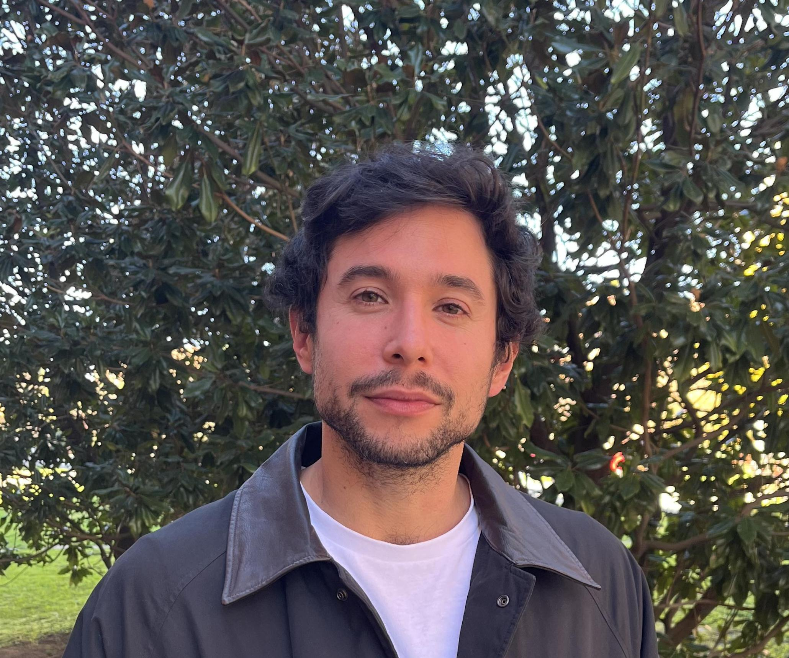

```{=html}
<div class="about-container">

  <div class="about-photo">
    
  </div>

  <div class="about-text">
    <div class="about-name">Joaquín Alcañiz Colomer</div>
    <div class="about-role">
      Postdoctoral Researcher · <a href="https://igop.uab.cat/es/" target="_blank">IGOP, Universitat Autònoma de Barcelona</a>
    </div>

    <div class="about-links">
      <a href="mailto:jcolomer@ugr.es">
        <i class="bi bi-envelope-fill"></i> Email
      </a>
      <a href="https://scholar.google.com/citations?user=lskhGOkAAAAJ&hl=es" target="_blank">
        <i class="bi bi-mortarboard-fill"></i> Google Scholar
      </a>
      <a href="https://twitter.com/jacolomer2" target="_blank">
        <i class="bi bi-twitter-x"></i> Twitter/X
      </a>
      <a href="https://github.com/jacolomer" target="_blank">
        <i class="bi bi-github"></i> GitHub
      </a>
      <a href="static/uploads/resume.pdf" target="_blank">
        <i class="bi bi-file-earmark-person-fill"></i> CV
      </a>
    </div>

    <p>
      I am a postdoctoral researcher on the
      <a href="https://cordis.europa.eu/project/id/101077363" target="_blank">WHOCOUNTS</a>
      project, led by Daniel Edmiston at IGOP, Universitat Autònoma de Barcelona.
      Most of my research focuses on the study of poverty from various perspectives.
      On one hand, I explore how people perceive and react to those in poverty,
      emphasizing attributions for poverty and how people define poverty.
      Currently, within the project, I am working on aspects related to the long-term
      effects of severe poverty, low-income dynamics, and the inclusion of populations
      excluded from poverty statistics (e.g., homeless people). I am also interested
      in studying social class and socioeconomic status from a psychosocial perspective,
      as well as the methodological and measurement aspects related to it.
    </p>

    <p>
      Soy investigador postdoctoral en el proyecto
      <a href="https://cordis.europa.eu/project/id/101077363" target="_blank">WHOCOUNTS</a>,
      dirigido por Daniel Edmiston en el IGOP, Universitat Autònoma de Barcelona.
      La mayor parte de mi investigación gira en torno al estudio de la pobreza desde
      diferentes perspectivas: cómo la gente percibe a las personas en situación de
      pobreza, las atribuciones sobre la pobreza, sus dinámicas a largo plazo, y la
      incorporación de poblaciones excluidas de las estadísticas (e.g., personas sin hogar).
      También me interesa el estudio de la clase social y el estatus socioeconómico desde
      una perspectiva psicosocial.
    </p>
  </div>

</div>

<div class="interests-edu">
  <div>
    <h3>Research Interests</h3>
    <ul>
      <li>Poverty perception &amp; attributions</li>
      <li>Social policies &amp; redistribution</li>
      <li>Socioeconomic status measurement</li>
      <li>Poverty dynamics &amp; measurement</li>
      <li>Punitive attitudes toward people in poverty</li>
      <li>Social class from a psychosocial perspective</li>
    </ul>
  </div>

  <div>
    <h3>Education</h3>

    <div class="edu-entry">
      <strong>Ph.D. in Social Psychology</strong>
      <span>University of Granada · 2018–2023</span>
    </div>

    <div class="edu-entry">
      <strong>Master's Degree in Social Problems</strong>
      <span>University of Granada · 2017–2019</span>
    </div>

    <div class="edu-entry">
      <strong>Master's Degree in Psychology of Social Intervention</strong>
      <span>University of Granada · 2016–2017</span>
    </div>

    <div class="edu-entry">
      <strong>Bachelor's Degree in Psychology</strong>
      <span>University of Valencia · 2012–2016</span>
    </div>
  </div>
</div>
```
